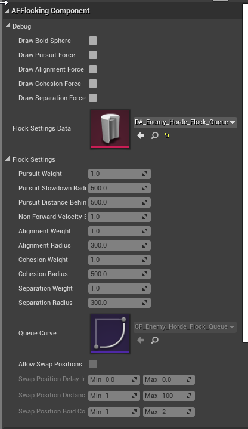
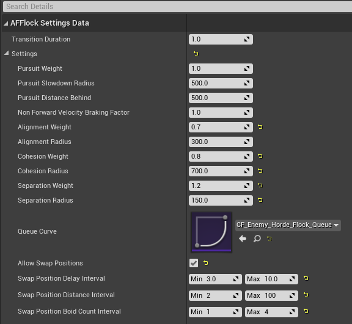
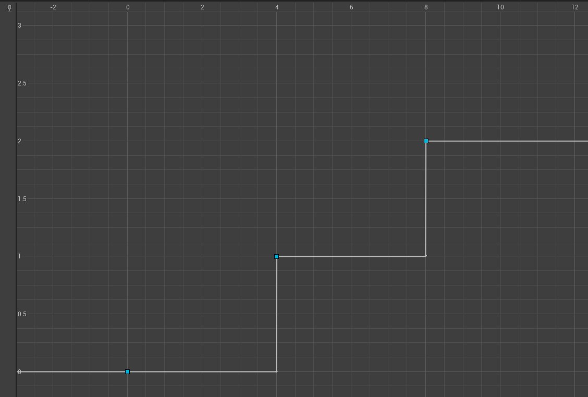

# Actor Flocking

This plug-in provides a component which you can use to make actors flock around a "parent" actor.

Flocking is a well know thing which allows to simulate the movement of large groups of entities. You can find more informations here: https://www.red3d.com/cwr/boids/

# Usage

You need to add the `AFFlockingComponent` component on the parent actor.

The details panel is split in two:

* A debug section which allows you to visualize the boids, and the various forces applied to each entity
* The Flock Settings section, where you can assign a `Flock Settings Data` asset, and below displays the current values of the settings.

Actors you wish to register to the flock must have a `CharacterMovementComponent` set to `Flying`.

To register an actor, you must pass its movement component to the `RegisterMovementComponent` function of the flocking component, and call `UnregisterMovementComponent` when you want to remove the actor from the flock.

# Settings

You create flock settings data by right-clicking in your content browser, select to create a new data asset, and select the type `UAFFlockSettingsData`.

The advantage of creating data assets is you can at run time apply new settings to your flock by calling the function `SetSettings` on the component.

Let's explain the various settings:

* **Transition duration**:  when you apply new settings, the component will lerp the various properties over time to ensure a smooth transition. That property determines the duration of that transition.
* **Pursuit weight**: the weight of the force applied to each boid to make it reach it's target. The target being the actor which owns the flocking component.
* **Pursuit Slowdown radius**: the radius of the sphere around the ownner of the flocking component, which will decrease the pursuit force for each boid inside. Boids outside of this radius won't be affected. Boids inside this radius will have their pursuit force decreased the closer they are to the target.
* **Pursuit Distance Behind**: Distance behind the owner of the flock that the boids will target. The flocking component takes the direction the owner moves, and multiplies it by that value to get a target "behind".
* **Non Forward Velocity Braking Factor**: For each boid, the flocking component gets the computed moving direction, and compares it with the direction the owning actor is moving to. If directions are opposite, we multiply the computed velocity by this value. This has the effect of negating completely the velocity if the factor is set to 1.0, resulting in a non-moving boid. This can be used to avoid your boids to move backwards.
* **Alignment/Cohesion/Separation weight**: The weight of the forces used to make boids move in the same direction / stay close to each other / move away from each other
* **Alignment/Cohesion/Separation radius**: The flock forces will be computed for each boid based on all other boids within that radius.
* **Queue Curve**: You can link a CurveFloat asset which will allow to offset the pursuit target for boids based on their index in the flock. This can be used to create groups of boids following each other, or a queue of boids. The abcissa is the boid index in the list, and the ordinate is the multiplier for the `Pursuit Distance Behind` property. \
On the following screenshot, you can see that boids from index 0 to 4 have a multiplier of 0, meaning they will target the flock owner. Boids with index from 4 to 8 will have a multiplier of 1. Meaning they fill follow the flock owner by 1.0f x `Pursuit Distance Behind`. All the remaining flocks will follow the flock owner by 2.0f * `Pursuit Distance Behind`.

* **Allow Swap Positions**: If you check this box, the flocking component will randomly swap boids in the list. You can configure the delay between each swap using `Swap Position Delay Interval`, the distance between each boid index using `Swap Position Distance Interval` (distance being the substraction of the index of each boid. This allows to avoid for example too distant boids to be swapped), and the number of boids to swap using `Swap Position Bopid Count Interval`.